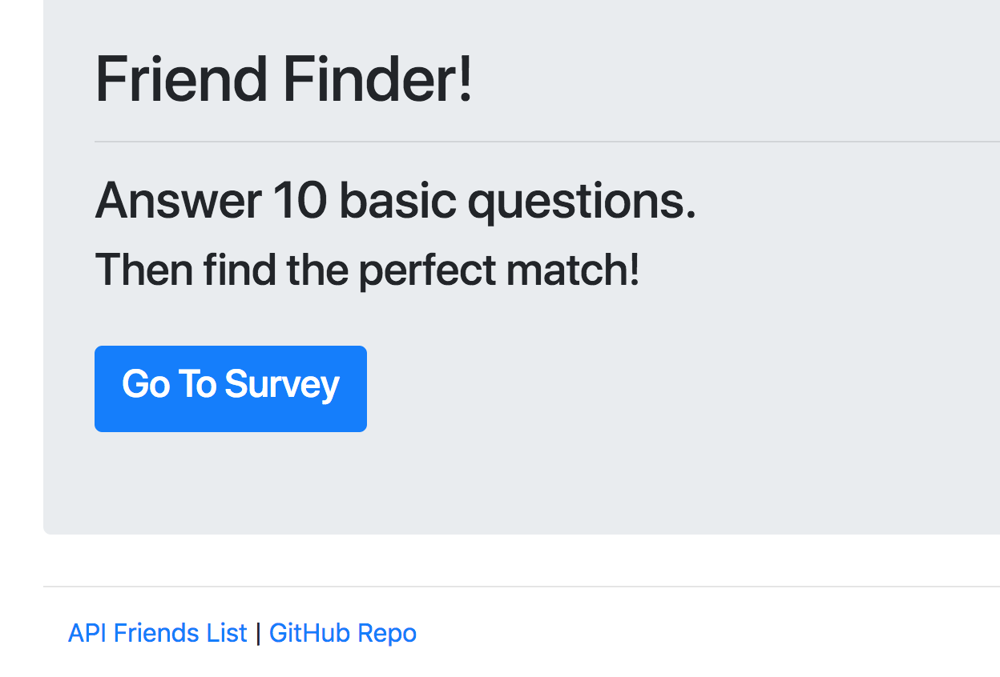
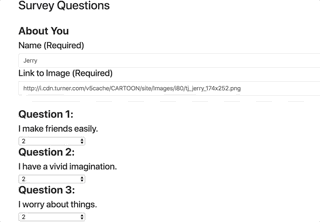

# Friend Finder

Welcome to Friend Finder! This full-stack site will take in results from your users' surveys, then compare their answers with those from other users. The app will then display the name and picture of the user with the best overall match:

# About This Project

This project was built using the following technologies:

<b>Programming Languages</b> 
HTML 
CSS (Bootstrap) 
Javascript (jQuery, Node.JS and Express) 
 

Please see the source code for more information.

# Collaborators

Jeremy Stepanovich 
https://github.com/jstep1 
 